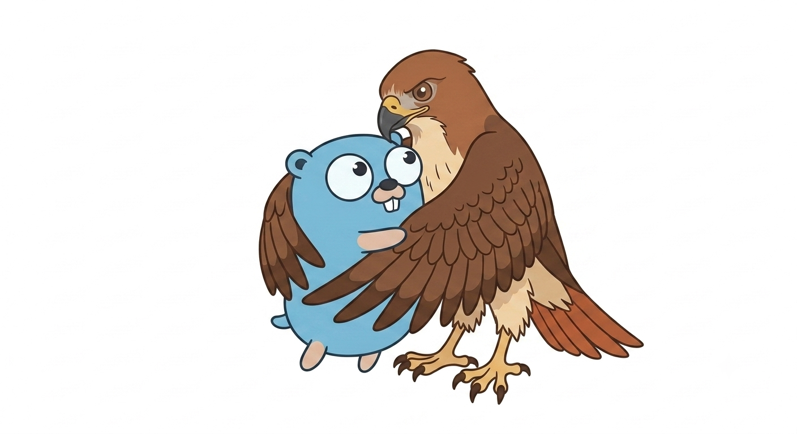

# gohawk

[](https://github.com/kojah/gohawk/actions/workflows/ci.yml)
[](https://github.com/kojah/gohawk/actions/workflows/ci.yml)

gohawk is a focused set of static analyzers for Go. It ships twenty-two
framework-neutral checks covering API design, concurrency, resource ownership,
determinism, serialization, tests, and error handling.

Sixteen broadly applicable checks run by default. Six policy-heavy checks are
opt-in and remain available through the same CLI: `apishape`, `closedomain`,
`globalstate`, `taintpolicy`, `testpolicy`, and `wirepolicy`.

gohawk is designed to run alongside
`go vet`, Staticcheck, and go-critic, filling gaps around ownership, lifecycle,
API contracts, and path-aware policy checks.

[Documentation](https://kojah.github.io/gohawk/) · [Analyzer reference](docs/analyzers/index.md)

## Contents

- [Quick Start](#quick-start)
- [Analyzers](#analyzers)
  - [API and data contracts](#api-and-data-contracts)
  - [Ownership and lifecycle](#ownership-and-lifecycle)
  - [Reliability and safety](#reliability-and-safety)
  - [Testing](#testing)
- [Analyzer reference](docs/analyzers/index.md)
- [Analyzer configuration](#analyzer-configuration)
- [Suppressions](#suppressions)
- [Contributing](docs/contributing.md)
- [License](#license)

## Quick Start

```sh
# Install.
go install github.com/kojah/gohawk@latest

# Run the default profile.
gohawk ./...

# See every analyzer, its profile, and its tags.
gohawk list

# Use it with go vet.
go vet -vettool="$(command -v gohawk)" ./...

# Preview safe fixes, then apply them.
gohawk -fix -diff ./...
gohawk -fix ./...

# Run selected opt-in checks, or exclude one from the defaults.
gohawk -wirepolicy -globalstate ./...
gohawk -determinism=false ./...

# Run every analyzer, including opt-in checks.
gohawk -enable-all ./...
```

## Analyzers

See the [analyzer reference](docs/analyzers/index.md) for in-depth guidance and examples for each analyzer.

### API and data contracts

| Analyzer | What it catches |
| --- | --- |
| [`apishape`](docs/analyzers/api-and-data-contracts/apishape.md) | Exported APIs with error-prone parameters or receiver shapes. |
| [`contextpolicy`](docs/analyzers/api-and-data-contracts/contextpolicy.md) | Misplaced, stored, or nil contexts, plus test contexts with the wrong owner. |
| [`closedomain`](docs/analyzers/api-and-data-contracts/closedomain.md) | Plain strings standing in for a closed set of values. |
| [`wirepolicy`](docs/analyzers/api-and-data-contracts/wirepolicy.md) | Missing serialization tags and positional wire literals. |

### Ownership and lifecycle

| Analyzer | What it catches |
| --- | --- |
| [`cancellationownership`](docs/analyzers/ownership-and-lifecycle/cancellationownership.md) | Context and signal cancellation functions that are never called. |
| [`channelpolicy`](docs/analyzers/ownership-and-lifecycle/channelpolicy.md) | Unexplained channel capacity and broken closing ownership. |
| [`deferinloop`](docs/analyzers/ownership-and-lifecycle/deferinloop.md) | Cleanup defers that retain per-iteration resources until the function returns. |
| [`exitpolicy`](docs/analyzers/ownership-and-lifecycle/exitpolicy.md) | Process termination that bypasses already registered deferred cleanup. |
| [`goroutineownership`](docs/analyzers/ownership-and-lifecycle/goroutineownership.md) | Goroutines without a recognizable lifecycle owner, including producers stranded on sends. |
| [`processownership`](docs/analyzers/ownership-and-lifecycle/processownership.md) | Started commands that are neither waited on nor transferred with wait ownership. |
| [`resourcelifetime`](docs/analyzers/ownership-and-lifecycle/resourcelifetime.md) | Files, responses, SQL handles, timers, or compressors left open on some path. |

### Reliability and safety

| Analyzer | What it catches |
| --- | --- |
| [`concurrentcapture`](docs/analyzers/reliability-and-safety/concurrentcapture.md) | Locals mutated by goroutines launched repeatedly. |
| [`determinism`](docs/analyzers/reliability-and-safety/determinism.md) | Unsorted map iteration that reaches ordered output. |
| [`errorownership`](docs/analyzers/reliability-and-safety/errorownership.md) | Errors handled twice or classified by matching their text. |
| [`evalorder`](docs/analyzers/reliability-and-safety/evalorder.md) | Later operands that mutate values evaluated earlier. |
| [`globalstate`](docs/analyzers/reliability-and-safety/globalstate.md) | Mutable package-level state. |
| [`lockorder`](docs/analyzers/reliability-and-safety/lockorder.md) | Mutexes acquired in contradictory orders or left held on a return path. |
| [`oncepolicy`](docs/analyzers/reliability-and-safety/oncepolicy.md) | Immediately discarded `sync.Once*` function wrappers. |
| [`syncmapatomicity`](docs/analyzers/reliability-and-safety/syncmapatomicity.md) | Non-atomic `sync.Map` load-and-delete claims. |
| [`taintpolicy`](docs/analyzers/reliability-and-safety/taintpolicy.md) | Untrusted environment or argument data reaching sensitive sinks. |

### Testing

| Analyzer | What it catches |
| --- | --- |
| [`blockingtest`](docs/analyzers/testing/blockingtest.md) | Blocking test channels without cancellation ownership. |
| [`testpolicy`](docs/analyzers/testing/testpolicy.md) | Missing lifecycle ownership in test helpers. |

Analyzer tags distinguish correctness defects, reliability risks, and
project-specific policy; see [Tags and profiles](docs/tags-and-profiles.md)
for the definitions. When a finding is intentional, you can [suppress it](#suppressions)
with a short explanation.

The analyzer reference marks policy-heavy checks as opt-in. Selecting any
analyzer by name runs only the analyzers named on that command line.

## Analyzer configuration

Analyzer options use standard `go/analysis` flags and work with both gohawk and
`go vet -vettool=...`. Prefix each option with its analyzer name:

```sh
gohawk -goroutineownership -goroutineownership.mode=join ./...
gohawk -contextpolicy -contextpolicy.prefer-test-context=false ./...
```

Available options are listed on each analyzer's page in the [analyzer reference](docs/analyzers/index.md).

## Suppressions

Put `//gohawk:ignore <analyzer> [reason]` on the flagged line or the line above:

```go
//gohawk:ignore goroutineownership worker belongs to the process lifecycle
go serveMetrics()
```

Ignores are always scoped to one analyzer. The reason is optional.

## License

Licensed under either the Apache License, Version 2.0 or the MIT License, at
your option.
