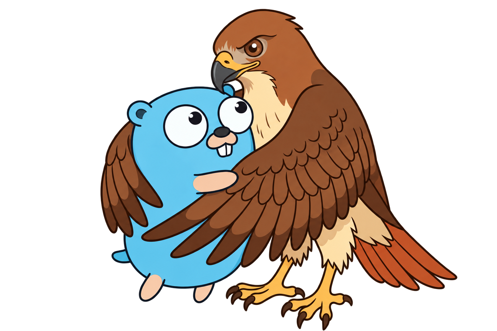

# gohawk

[](https://github.com/kojah/gohawk/actions/workflows/ci.yml)
[](https://github.com/kojah/gohawk/actions/workflows/ci.yml)

gohawk is a focused set of static analyzers for Go, designed to run alongside
`go vet`, Staticcheck, and go-critic. It covers gaps around ownership,
lifecycle, concurrency, API contracts, and path-aware policy checks.

It draws inspiration from [go-critic](https://github.com/go-critic/go-critic),
but is deliberately more focused on correctness and reliability, with fewer
opinionated style checks.

[Read the documentation](https://kojah.github.io/gohawk/)

## Quick Start

```sh
# Install.
go install github.com/kojah/gohawk@latest

# Run the default profile.
gohawk ./...

# See every analyzer, its profile, and its group.
gohawk list

# Inspect an analyzer or one of its checks.
gohawk doc contextpolicy
gohawk doc contextpolicy/nil-context

# Use it with go vet.
go vet -vettool="$(command -v gohawk)" ./...

# Preview safe fixes, then apply them.
gohawk -fix -diff ./...
gohawk -fix ./...

# Run selected opt-in analyzers, or exclude one from the defaults.
gohawk -enable=wirepolicy,globalstate ./...
gohawk -disable=oncepolicy ./...

# Run complete analyzer groups with their default checks.
gohawk -enable-groups=ownership,testing ./...

# Run one opt-in check.
gohawk -enable-checks=contextpolicy/test-context ./...

# Remove groups from the default profile or from -enable-all.
gohawk -disable-groups=testing ./...

# Run every analyzer and check.
gohawk -enable-all ./...
```

## Contributing

Contributions are welcome. See [How to contribute](https://kojah.github.io/gohawk/contributing/)
for the development workflow, analyzer requirements, and verification steps.

## Sponsorship

If gohawk is useful to you or your organization, consider sponsoring its
continued development. Sponsorship helps fund maintenance, new analyzers, and
improvements to the documentation and developer experience. To discuss
sponsorship, get in touch with [@kojah](https://github.com/kojah).

## License

Licensed under either the Apache License, Version 2.0 or the MIT License, at
your option.
